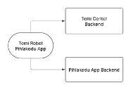

# RAC – Testing and validating a Robot Activity Coordinator to enhance the well-being of the elderly at the care homes

## Summary
| Company Name | [Pihlakodu AS](https://pihlakodu.ee) |
| :--- | :--- |
| Development Team Lead Name | [Janika Leoste](https://www.etis.ee/CV/Janika_Leoste/eng)|
| Development Team Lead E-mail | [janika.leoste@taltech.ee](janika.leoste@taltech.ee) |
| Duration of the Demonstration Project | July 2024 - March 2025 |

# Description
## Objectives of the Demonstration Project

The goal of this project was to test and validate a customized application for AI-powered TEMI robot assistant in elderly care, focusing on automating routine activity coordination tasks. Rather than replacing human staff, the robot was targeted towards supporting and collaborating with care workers, helping to address workforce shortages and improve service delivery. At Pihlakodu two care homes (Tabasalu and Viimsi), the robot was adapted by RAC application to automate communication tasks and share important information and daily news with residents, support social interaction, especially for less mobile residents and assist with wayfinding for guests and residents. 
By integrating the robot into daily operations, the project aimed to reduce staff workload, enhance resident engagement, and allow caregivers to focus more on personal interaction. This demo also served as a testing ground for scaling similar robotics and AI solutions across Estonia’s elderly care sector.

## Activities and Results of the Demonstration Project
### Challenge addressed

As the population continues to age and the working-age population declines, the care sector is under mounting pressure. Recruiting and retaining qualified care workers is becoming increasingly difficult, while the demand for care services steadily rises. This creates a critical bottleneck that affects both the well-being of residents and the sustainability of care services. Solutions that improve efficiency and assist staff in providing meaningful, person-centred care are essential to ensure the resilience and long-term viability of the sector. Care homes are facing growing staff shortages, making it difficult to provide equal access to information and social engagement, especially for bedridden or cognitively impaired residents. These individuals often miss out on updates and activities due to limited staff capacity to communicate. To tackle this challenge, the project tested an application for TEMI robot assistant that supports care staff by automating routine communication tasks. The usage scenarios for this application were designed collaboratively between the TalTech IT College and the Pihlakodu and the Robot Activity Coordinator application was validated in real-life work processes at Pihlakodu Viimsi and Tabasalu care homes.

### Data Sources

The Functionality of the Robot Activity Coordinator Application 
We used TEMI robot assistant version v3 as a Robot Activity Coordinator. The TEMI robot is an autonomously functioning AI-supported assistant robot that offers various features, such as command recognition, pre-set location storage, and adept navigation. The TEMI robot has the capability to function as a telepresence robot, allowing remote participation through the robot. Crucial element for TEMI is the TEMI Center Pro service, necessary for unlocking the robot’s full functionality. This includes room mapping, mobile application integration, Alexa/Hey functions, video calls, and more. The TEMI Center Pro is also valuable for implementing multi-party calls, scheduling, face recognition, and various applications, thereby enhancing the overall user experience. It can also serve as a personal AI assistant, autonomously interacting with people and performing simple tasks. However, important to note is the fact that the robot functions that require oral commands or language-based interaction do function mainly in English or other large languages, and one necessity of RAC as application was to make the robot easy to use also in Estonian.  The Robot Activity Coordinator application for the TEMI robot assistant was programmed using Android Studio 11.0 Kotlin application, integrating the built-in features of the TEMI. Previously developed initial application and backend solution was adapted to elderly care home requirements as RAC. Temi Robot SDK improvements were also piloted. Whisper AI based ASR/STT system was taken in use.  

Adapted functionality:
* House guide
* House patrol, with customizable announcement messages
* Multi floor support
* Categories of Text-To-Speech articles (menu, schedule, varia)
* News reader
* Web based cognitive games
* Human detection, greeting messages
* ASR/STT and TTS interface
* Protected settings activity
* Backend for app content management. 

### AI Technologies

The application validated in the project utilizes following generally accepted AI algorithms and methods that let TEMI robot assistant to perform its functions: 
- Autonomous navigation: TEMI uses an efficient autonomous navigation algorithm to drive and control its movements, enabling it to understand and interact with its environment.
- Voice interaction: TEMI is equipped with Auto Speech Recognition (ASR/STT), far-field voice technology, natural language processing (NLP), speech-to-text, and text-to-speech (TTS) engines. These allow TEMI to hear, identify, understand, and respond to user’s voice commands.

### Technological Results

This AIRE demo project piloted the use of two TEMI v3 robots – affectionally named Olle and Pipi by the residents at staff at Pihlakodu's Viimsi and Tabasalu care homes. The goal was to test dedicated application of socially assistive robot as activity coordinator in order to enhance resident engagement, reduce information gaps, and support activity instructors, especially considering the less socially active residents. The robots delivered news updates, daily schedules, menus, activity reminders, memory-stimulating games, prompts towards positivity and staying hydrated, and enabled video calls - bringing both joy and improved inclusion to residents and staff. The solution was tested to complement human care, allowing staff to focus on personal interactions and focussing on less mobile residents.  

RAC was co-designed and piloted over several months and the results were gathered from staff as SWOT insights: 
*	Strengths: increased resident engagement, improved communication, intuitive interface, positive emotional impact.
*	Weaknesses: occasional technical glitches and a need for better activity customization.
*	Opportunities: potential broader use in care homes, depending on refined AI and language interaction, and expanded personalization (such as interaction based on facial recognition).
*	Threats: tech adoption resistance and funding challenges for scaling and support.

Staff feedback confirmed robots as valuable assistants that have the potential to enhance the overall care experience. The project further highlighted the importance of natural language interaction and smart design to achieve comfort and trust. Building on this test-before-invest experience, Pihlakodu plans to expand robotic integration and further develop AI-assisted features to support the well-being of elderly residents and bring more humanity to care through technology.

### Technical Architecture

### User Interface 

Our previous software was adapted and enhanced for elderly care use. UI is presented as integral part of robot. Admin access was provided for activity managers to update content used in robot app (readable texts). The following pictures illustrate a) Robot in standby mode in the docking station, RAC is always activated. And b) screenshot of the active app. 

### Future Potential of the Technical Solution

One TEMI robot will remain at Pihlakodu for an additional test period. The Test-Before-Invest project proved to be very valuable; however, one of the key lessons learned (see below) was that it takes more time than expected to design usage scenarios, test them with end users, and improve the application based on those results - especially when aiming to integrate a new technical solution into everyday work processes. This was also the main challenge for the RAC project: understanding the workflow well enough for the robot to integrate seamlessly into daily life at the care home. TalTech and Pihlakodu will continue working on this in the upcoming months. We plan to use the RAC in other Pihlakodu care homes in 2025 through shorter pilots to gain a clearer understanding of overall acceptance from both staff and residents. This will help Pihlakodu better assess the long-term potential and value of this investment. Additionally, two other large care homes - Südamekodu and Iru Hooldekodu - have shown interest in the RAC and TEMI robot. At Iru Hooldekodu, TalTech plans to conduct a short demonstration pilot in July while Südamekodu cooperation awaits possible new funding opportunities. 

### Lessons Learned

The Test-Before-Invest demo project provided valuable, real-world insights into deployment and usability of robot assistants in mainly social functions (such as TEMI) in elderly care settings. The project validated robot as assistant, not as a replacement of humans. When designed and implemented thoughtfully, these types of solutions can enhance human interaction, improve workflow efficiency, and support the emotional and social well-being of residents. The project laid the foundation for scaling the RAC solution across other care homes. Interest from other care institutions such as Iru Care Home and Südamekodu Care Home confirms the relevance and potential in this. While the project confirmed many benefits, it also highlighted several practical, technical, and strategic lessons critical for future success and scaling. Important to note is the fact that robots available at reasonable price on the market today do need adapting to and understanding of their limitations. 
1. TEMI robots can effectively take over some routine, repetitive tasks such as announcements, reminders, and content sharing, freeing up staff to focus on different tasks and personalized care. When implemented successfully, this change can reduce caregiver workload and thereby enhance the overall resident experience.
2. The RAC solution can increase engagement and access to information for bedridden or less mobile clients, who often miss out on group activities. The ability to receive news, reminders, games, and video calls directly from the robot has the potential to improve their sense of inclusion and quality of life. However, more personalization and more time with the robot is essential for the residents to understand this new technology and accept this not as a novelty, but part of the routine care process.
3. One of the key lessons was that effective integration takes time. Embedding new technology into care home routines is complex and must be approached with flexibility and patience. From designing use scenarios to testing them with real users and refining the application, the process depends on sustained collaboration. 
4. Adoption depends heavily on well-planned, personalized training. Short, practical sessions helped caregivers and activity coordinators gain confidence and understand how the robot can support - rather than replace - their work. However, staff would benefit from more comprehensive training on the robot as part of their daily work process as well as inclusion of any new staff. Building acceptance also requires clear communication about the robot’s purpose, which may need constant reminder in the implementation process.
5. A significant challenge is the lack of technical expertise within care homes. Most facilities do not have dedicated IT staff, making regular maintenance, troubleshooting, and updates difficult. In the RAC project, TalTech provided the company with necessary assistance and advice, however, this is a challenge as well as opportunity for future (for instance, the sellers of such robots in Estonia do not currently provide such support and this might pose a significant challenge for elderly care homes to adopt robots).  Ongoing remote and in-person technical support is essential and must be factored into any long-term deployment plan.
6. Care staff at Pihlakodu highlighted the need for robots to be more adaptable to the specific preferences and changing needs of both residents and staff. This includes flexible scheduling features, personalized interaction content, and easier ways to tailor announcements or games.
7. Deploying socially assistive robots in care homes requires a multidisciplinary approach. This includes programmers and engineers to adapt and maintain the platform considering the specific needs of specific elderly care home (these needs might differ, so no one-solution-fits-all is truly viable). Geriatrics experts must be included to ensure age- and condition-appropriate use, but also game designers and educators are necessary to consult with to provide cognitive stimulation and entertainment as well as train the staff and create capacity to educate the elderly on the use of robot – for social robot such as TEMI, access to entertainment meaning free, localized content such as games and news feeds can significantly increase the robot’s perceived usefulness. Finally, quality management to ensure practical alignment with real-world workflows is essential.
8. Overall, one of the most impactful features and development needs is the integration of an Estonian natural language model, which allows for intuitive interaction, but which currently needs significant further development that was outside of the timeframe of this project. Many of the staf and elderly “wanted” to have a conversation with the robot in the same manner than they do with another human – something that is not yet possible.  Furthermore, the robot has the potential to support multilingual interaction, such as helping Russian-speaking staff learn Estonian through guided conversation. This opens new possibilities for language learning, inclusion, and cultural sensitivity in diverse work and care environments.

